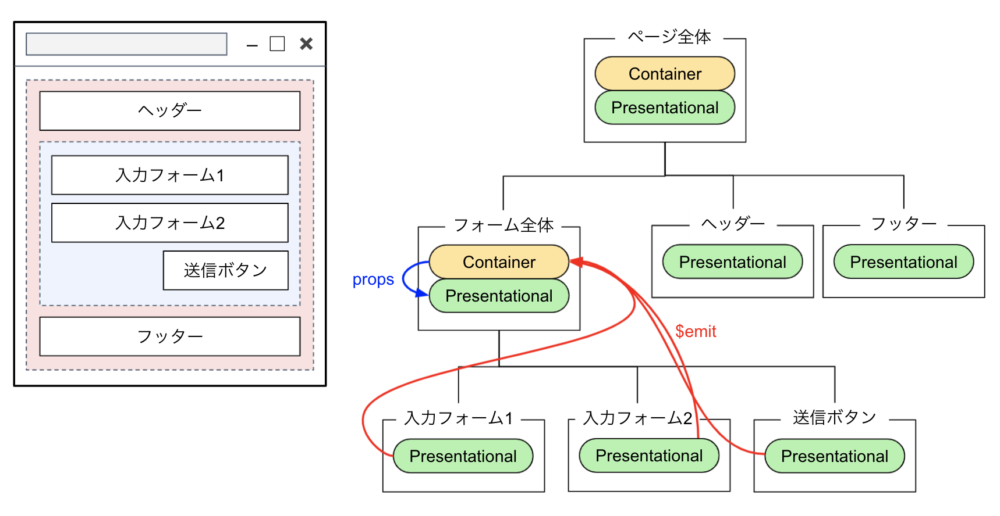
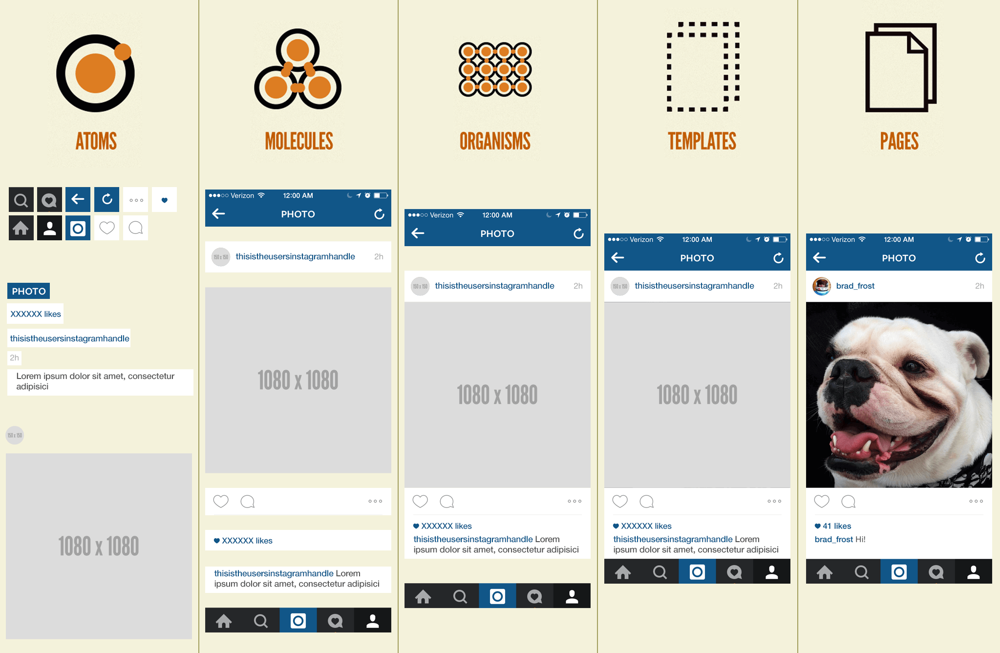

# Vue.jsで考えるコンポーネント設計

## 0 はじめに

Vue.jsなどのコンポーネントを用いたフロントエンド開発においてコンポーネント設計は必要不可欠です。コンポーネント設計とは、コンポーネントをどのような粒度で、どのような状態で分割してページを構成していくのかを設計することです。

適切にコンポーネント設計をせずに開発を進めると以下のような弊害が生じる可能性があります。

- 再利用性、拡張性の低いコンポーネントの構成になる
- 1つのコンポーネントのコードが肥大化、複雑化する
- componentsディレクトリ配下に粒度、役割の異なるコンポーネントが混在し、管理が複雑化する
- 密結合となりテストがしにくくなる

などなど。

これらの課題を解消するコンポーネントの設計およびプロジェクトのディレクトリ構成について考えていきます。

<br>

**対象読者**

- Vue.jsやReact.jsなどのフロントエンドフレームワークの知識を有する方、およびこれらを用いた開発に携わっている方
- 再利用性、拡張性の高いコンポーネントを作りたいねんと思っている方
- でもコンポーネントの設計に迷走しているねんという方

<br>

## 1 フロントエンド開発におけるコンポーネント設計手法

まずはフロントエンド開発の現場で採用されている設計手法を見ていきます。主な設計手法として以下の2つがあります。

1. Presentational and Container Components パターン
2. Atomic Design パターン

<br>

### 1.1 Presentational and Container Components パターン

<a href="https://medium.com/@dan_abramov/smart-and-dumb-components-7ca2f9a7c7d0">Presentational and Container Components</a> パターンは、Facebook社ReactチームのソフトウェアエンジニアであるDan Abramov氏が考案したコンポーネント設計手法です。コンポーネントを役割毎に **Presentational Component** と **Container Component** の2つに分けてUIを構成します。Reactの設計パターンとして考案されたものですが、Vue.jsに適用すると以下のように解釈できます。

<br>

#### Presentational Component

- 見た目に関する責務を負う。
- 子要素としてPresentational ComponentやContainer Componentを持つことができる。
- マークアップやスタイルを書く。
- propsで受け取った値の表示はするが、データを自身で勝手に読み込んだり、改変したりしない。
- 状態を持つことはない（持ったとしても自身のUIに関する状態のみ）。
- 自分以外（StoreやVue Routerなどの機能）に依存しない。

#### Container Component

- コンポーネントの振る舞い（ロジック）に関する責務を負う。
- 子要素としてPresentational ComponentやContainer Componentを持つことができる。
- マークアップやスタイルは原則書かない。
- データおよびデータを扱うための関数をPresentational Componentに渡す。
- Storeのデータへのアクセスやミューテーションの呼び出し（commit）、アクションの呼び出し（dispatch）を行う。

<br>

画面描画を担当するPresentational Componentは、propsで受け取った値を表示することを担当します。methodsオプションを持たず、入力やクリックなどのイベントが起こった場合は、$emitを使って上位のコンポーネント（Container Component）に処理を委ねます。

処理を担当するContainer Componentは、Storeへアクセスすることができ、読み込んだデータや関数をpropsでPresentational Componentに渡します。

> Vue.jsでは、親から子へデータを渡すのにpropsを、子から親へ処理を依頼するのに$emitを使用します。Container Componentで用意したデータをprops経由でPresentational Componentに渡し、Presentational Componentで入力などのイベントが発生したら$emitで上位のContainer Componentに処理を依頼するといった流れになります。



<br>

#### 利点

- UI部分と振る舞い部分を明確に分離できる。
- 振る舞いに依存しないため再利用性が高くなる。
- デザイナーが振る舞い部分（ロジック）に干渉することなく修正できるため分業しやすくなる。

#### 課題

見た目と振る舞いの2種類では分割の粒度が粗いため、大規模なアプリケーションには向かないかもしれません（小・中規模向け）。また、ユニットテストがしづらくなる可能性があります。プロジェクトのディレクトリ構成においては粒度の異なるコンポーネントが同一ディレクトリに配置され、コンポーネントファイルを探しづらくなるかもしれません。

<br><br>

### 1.2 Atomic Design パターン

<a href="https://atomicdesign.bradfrost.com/">Atomic Design</a> パターンは、アメリカのWebデザイナーであるBrad Frost氏が考案したデザインシステムです。あくまでもデザインの設計思想であり、フロントエンドの実装向けに考案されたものではありません。フロントエンド開発におけるAtomic Designでは、画面要素を5つのレベルに分け、これらの要素を組み合わせることでUIを構成していきます。各レベルを「原子」や「分子」といった化学用語で表現し、それぞれコンポーネントの粒度を表します。



<br><br>

<table>
<tr>
    <th>#</th>
    <th>レベル</th>
    <th width="500">説明</th>
    <th>イメージ図</th>
</tr>
<tr>
    <td>
    1
    </td>
    <td>
    Atoms
    </td>
    <td>
    最も小さい粒度であり、それ以上分解できない要素です。<br>デザインシステムで最も基本的なデザインパーツです。<br>リンクやテキストボックス、ボタンなどのUIパーツが該当します。<br>（Atom = 原子）
    </td>
    <td>
    
    </td>
</tr>
<tr>
    <td>
    2
    </td>
    <td>
    Molecules
    </td>
    <td>
    2つ以上の原子を組み合わせたUIパーツです。<br>複数の原子（基本的なデザインパーツ）をまとめて有効な機能が生まれます。<br>ラベルとテキストボックスを組み合わせた入力フォームなどが該当します。<br>ただし、<strong>独立して機能するとは言えない</strong>ものが属します。<br>例えば、投稿リアクション（いいねやコメント数など）は複数のコンポーネントの組み合わせで構成されますが、リアクションの対象の記事があって初めて機能するため独立しているとは言えません。<br>（Molecule = 分子）
    </td>
    <td>
    
    </td>
</tr>
<tr>
    <td>
    3
    </td>
    <td>
    Organisms
    </td>
    <td>
    AtomsとMoleculesの組み合わせで構成されるUIパーツです。<br>Moleculesとの違いは、<strong>独立して機能する</strong>デザインパーツであることです。<br>例えば、広告バナーやコメント投稿フォームは、どのページにそのまま配置しても機能として成り立つため独立していると言えます。<br>（Organism = 有機体、生体）
    </td>
    <td>
    
    </td>
</tr>
<tr>
    <td>
    4
    </td>
    <td>
    Templates
    </td>
    <td>
    いくつかのOrganisms、Molecules、Atomsから構成されるUIの骨組みです。<br>Templatesの段階では、まだページのコンテンツは反映されておらず、ワイヤーフレームとして定義されます。
    </td>
    <td>
    
    </td>
</tr>
<tr>
    <td>
    5
    </td>
    <td>
    Pages
    </td>
    <td>
    Templatesに実際のコンテンツを反映し、ユーザーが目にする最終的なデザインとなるものです。ページはコンテンツによって動的にデザインパーツを変える必要があります。
    </td>
    <td>
    
    </td>
</tr>
</table>

> Atoms、Molecules、Organismsは化学用語で表現されていますが、TemplatesとPagesは例外です。Atoms、Molecules、Organismsに関しては内部的で、コンポーネント分類の概念を開発者が認識できればいいものです（化学用語でも何でもいいと思う）。一方で、TemplatesとPagesに関してはPM/PLや開発メンバー、クライアントなどに説明するものであることを明確にする意味が込められているそうです。

<br>

Nuxt.jsによる開発でAtomic Designを採用する場合、各レベルをNuxt.jsプロジェクトのディレクトリ構成に適用するとおおよそ以下のようになります。

| Nuxt.js | Atomic Design |
|:--------|:--------------|
| components | Atoms / Molecules / Organisms |
| layouts | Templates |
| pages | Pages |

componentsディレクトリは内包するAtoms、Molecules、Organismsでディレクトリを分けて運用することになります。

```
プロジェクト
　　　│
　　　├── components
　　　│     　├── atoms
　　　│     　├── molecules
　　　│     　└── organisms
　　　├── layouts
　　　└── pages
```

<br>

#### 利点

- 粒度に分けてデザインパーツを作成するため、再利用性が高まる。
- デザインの統一や変更に強くなる。
- 開発メンバー間で作業分担がしやすくなる。
- デザイナーと意思疎通がしやすくなる。
- ディレクトリ毎にコンポーネントの粒度が揃う。
- 大規模なアプリケーションに向いている。

#### 課題

- Atomic Designの設計思想に厳格に合わせようとすると、逆に構造が複雑化し、メンテナンス性が悪くなる可能性があります。チームやアプリケーションに合わせて独自の構造や仕組みを取り入れることも重要になります。
- 対象のコンポーネントを Molecules と Organisms のどちらに含めていいかわからなくなる、もしくは開発メンバー間で認識がズレることが往々にしてあります。振り分けの目安の1つに、前述の「独立して機能する」かどうかがありますが、チーム内で明確に認識合わせをしておくといいでしょう。
- コンポーネント間のデータや処理のやり取り（propsや$emit）がバケツリレーのように発生し、面倒になり得ます。頻繁にやり取りするデータはStoreに保持するなど、Storeの設計も考慮した方がいいかもしれません。